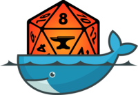

# FoundryVTT



## Description
This docker image provides the FoundryVTT system for hosting your own virtual table top games.

## Notes
**Template created by Pi\-Hosted Series**  
**Check our Github page: [https://github.com/pi\-hosted/pi\-hosted](https://github.com/pi-hosted/pi-hosted)**  
  
**Official Webpage:** <https://foundryvtt.com/>  
**Official Docker Documentation:** <https://hub.docker.com/r/felddy/foundryvtt>  
  
  


## Image
felddy/foundryvtt:release

## Categories
- Other
- Games

## Ports
- 30000:30000/tcp

## Volumes
| Container | Bind |
|-----------|------|
| /data | /opt/appdata/foundryvtt |

## Environment Variables
| Name | Label | Default | Description |
|------|-------|---------|-------------|
| FOUNDRY_USERNAME | Foundry Account Name | ```John``` | `````` |
| FOUNDRY_PASSWORD | Foundry Password | ```password``` | `````` |
| FOUNDRY_ADMIN_KEY | Instance Admin Password | ```changeme``` | `````` |
| CONTAINER_PRESERVE_CONFIG | CONTAINER_PRESERVE_CONFIG | ```true``` | `````` |

## Labels
| Key | Value |
|-----|-------|
| traefik.enable | ```true``` |
| traefik.http.routers.foundryvtt.rule | ```Host(`foundryvtt.{$TRAEFIK_INGRESS_DOMAIN}`)``` |
| traefik.http.routers.foundryvtt.entrypoints | ```https``` |
| traefik.http.services.foundryvtt.loadbalancer.server.port | ```30000``` |
| traefik.http.routers.foundryvtt.tls | ```true``` |
| traefik.http.routers.foundryvtt.tls.certresolver | ```default``` |
| traefik.http.routers.foundryvtt.middlewares | ```traefik-forward-auth``` |
| mafl.enable | ```true``` |
| mafl.title | ```FoundryVTT Server``` |
| mafl.description | ```This docker image provides the FoundryVTT system for hosting your own virtual table top games.``` |
| mafl.link | ```https://foundryvtt.{$TRAEFIK_INGRESS_DOMAIN}``` |
| mafl.icon.wrap | ```true``` |
| mafl.icon.color | ```#007acc``` |
| mafl.status.enabled | ```true``` |
| mafl.status.interval | ```60``` |
| mafl.group | ```Other``` |
| mafl.icon.url | ```https://raw.githubusercontent.com/pi-hosted/pi-hosted/master/images/foundrylogo.png``` |

