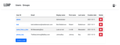

# LLDAP



## Description
This project is a lightweight authentication server that provides an opinionated, simplified LDAP interface for authentication.

## Notes
**Template created by Pi\-Hosted Series**  
**Check our Github page: [https://github.com/pi\-hosted/pi\-hosted](https://github.com/pi-hosted/pi-hosted)**  
  
**Official Webpage:** <https://github.com/nitnelave/lldap>  
**Official Docker Documentation:** <https://github.com/nitnelave/lldap>  
  
### **[Pre\-installation script](https://github.com/pi-hosted/pi-hosted/blob/master/tools/install_lldap.sh) must be RAN before you install:** wget \-qO\- https://raw.githubusercontent.com/pi\-hosted/pi\-hosted/master/tools/install\_lldap.sh \| bash

  
  


## Image
nitnelave/lldap:stable-debian

## Categories
- Tools
- Productivity

## Ports
- 3890:3890/tcp
- 17170:17170/tcp

## Volumes
| Container | Bind |
|-----------|------|
| /data | /opt/appdata/lldap/data |

## Environment Variables
| Name | Label | Default | Description |
|------|-------|---------|-------------|
| LLDAP_JWT_SECRET | LLDAP_JWT_SECRET | ```somesecretjwt``` | `````` |
| LLDAP_LDAP_USER_PASS | LLDAP_LDAP_USER_PASS | ```someadminpassword``` | `````` |
| LLDAP_LDAP_BASE_DN | LLDAP_LDAP_BASE_DN | ```dc=example,dc=com``` | `````` |

## Labels
| Key | Value |
|-----|-------|
| traefik.enable | ```true``` |
| traefik.http.routers.lldap.rule | ```Host(`lldap.{$TRAEFIK_INGRESS_DOMAIN}`)``` |
| traefik.http.routers.lldap.entrypoints | ```https``` |
| traefik.http.services.lldap.loadbalancer.server.port | ```3890``` |
| traefik.http.routers.lldap.tls | ```true``` |
| traefik.http.routers.lldap.tls.certresolver | ```default``` |
| traefik.http.routers.lldap.middlewares | ```traefik-forward-auth``` |
| mafl.enable | ```true``` |
| mafl.title | ```LLDAP``` |
| mafl.description | ```This project is a lightweight authentication server that provides an opinionated, simplified LDAP interface for authentication.``` |
| mafl.link | ```https://lldap.{$TRAEFIK_INGRESS_DOMAIN}``` |
| mafl.icon.wrap | ```true``` |
| mafl.icon.color | ```#007acc``` |
| mafl.status.enabled | ```true``` |
| mafl.status.interval | ```60``` |
| mafl.group | ```Tools``` |
| mafl.icon.url | ```https://raw.githubusercontent.com/pi-hosted/pi-hosted/master/images/lldap.png``` |

