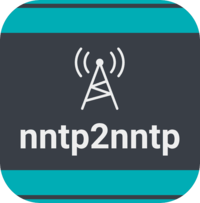

# Nntp2nntp



## Description
Nntp2nntp proxy allow you to use your NNTP Account from multiple systems, each with own user name and password. It fully supports SSL and you can also limit the access to proxy with SSL certificates. nntp2nntp proxy is very simple and pretty fast. Warning Whilst we know of no nntp2nntp security issues the upstream code for this project has received no changes since 06\.08\.15 and is likely abandoned permanently. For this reason we strongly recommend you do not make this application public facing and if you must do so other layers of security and SSL should be considered an absolute bare minimum requirement. We see this proxy being used primarily on a LAN so that all the users NNTP applications can share a common set of internal credentials allowing for central managment of the upstream account e.g change provider, server, thread limits for all applications with one global config change.

## Image
linuxserver/nntp2nntp:latest

## Categories
- Uncategorized Services

## Ports
- 1563:1563/tcp

## Volumes
| Container | Bind |
|-----------|------|
| /config | /opt/appdata/nntp2nntp |

## Environment Variables
| Name | Label | Default | Description |
|------|-------|---------|-------------|
| PUID | PUID | ```1024``` | ```for GroupID``` |
| PGID | PGID | ```100``` | ```for UserID``` |
| PUID | PUID | ```<yourUID>``` | ```specify your UID``` |
| PGID | PGID | ```<yourGID>``` | ```specify your GID``` |
| TZ | TZ | ```Europe/Amsterdam``` | ```Specify a timezone to use for example Europe/Amsterdam``` |

## Labels
| Key | Value |
|-----|-------|
| traefik.enable | ```true``` |
| traefik.http.routers.nntp2nntp.rule | ```Host(`nntp2nntp.{$TRAEFIK_INGRESS_DOMAIN}`)``` |
| traefik.http.routers.nntp2nntp.entrypoints | ```https``` |
| traefik.http.services.nntp2nntp.loadbalancer.server.port | ```1563``` |
| traefik.http.routers.nntp2nntp.tls | ```true``` |
| traefik.http.routers.nntp2nntp.tls.certresolver | ```default``` |
| traefik.http.routers.nntp2nntp.middlewares | ```traefik-forward-auth``` |
| mafl.enable | ```true``` |
| mafl.title | ```Nntp2nntp``` |
| mafl.description | ```Nntp2nntp proxy allow you to use your NNTP Account from multiple systems, each with own user name and password.``` |
| mafl.link | ```https://nntp2nntp.{$TRAEFIK_INGRESS_DOMAIN}``` |
| mafl.icon.wrap | ```true``` |
| mafl.icon.color | ```#007acc``` |
| mafl.status.enabled | ```true``` |
| mafl.status.interval | ```60``` |
| mafl.group | ```Services``` |
| mafl.icon.url | ```https://raw.githubusercontent.com/linuxserver/docker-templates/master/linuxserver.io/img/nntp2nntp.png``` |

