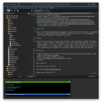

# Pylon



## Description
Pylon is a web based integrated development environment built with Node.js as a backend and with a supercharged JavaScript/HTML5 frontend, licensed under GPL version 3\. This project originates from Cloud9 v2 project.

## Image
linuxserver/pylon:latest

## Categories
- Uncategorized Services

## Ports
- 3131:3131/tcp

## Volumes
| Container | Bind |
|-----------|------|
| /config | /opt/appdata/pylon/config |
| /code | /opt/appdata/pylon/code |

## Environment Variables
| Name | Label | Default | Description |
|------|-------|---------|-------------|
| PUID | PUID | ```1024``` | ```for UserID``` |
| PGID | PGID | ```100``` | ```for GroupID``` |
| TZ | TZ | ```Europe/Amsterdam``` | ```specify a timezone to use, see this [list](https://en.wikipedia.org/wiki/List_of_tz_database_time_zones#List).``` |
| GITURL | GITURL | ```https://github.com/linuxserver/docker-pylon.git``` | ```Specify a git repo to checkout on first startup``` |
| PYUSER | PYUSER | ```myuser``` | ```Specify a basic auth user.``` |
| PYPASS | PYPASS | ```mypass``` | ```Specify a basic auth password.``` |

## Labels
| Key | Value |
|-----|-------|
| traefik.enable | ```true``` |
| traefik.http.routers.pylon.rule | ```Host(`pylon.{$TRAEFIK_INGRESS_DOMAIN}`)``` |
| traefik.http.routers.pylon.entrypoints | ```https``` |
| traefik.http.services.pylon.loadbalancer.server.port | ```3131``` |
| traefik.http.routers.pylon.tls | ```true``` |
| traefik.http.routers.pylon.tls.certresolver | ```default``` |
| traefik.http.routers.pylon.middlewares | ```traefik-forward-auth``` |
| mafl.enable | ```true``` |
| mafl.title | ```Pylon``` |
| mafl.description | ```Pylon is a web based integrated development environment built with Node.``` |
| mafl.link | ```https://pylon.{$TRAEFIK_INGRESS_DOMAIN}``` |
| mafl.icon.wrap | ```true``` |
| mafl.icon.color | ```#007acc``` |
| mafl.status.enabled | ```true``` |
| mafl.status.interval | ```60``` |
| mafl.group | ```Services``` |
| mafl.icon.url | ```https://raw.githubusercontent.com/pylonide/pylon/master/doc/screenshot02.png``` |

