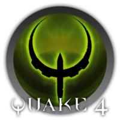

# QuakeJs



## Description
QuakeJs is a multiplayer game played from your browser

## Notes
**Template created by Pi\-Hosted Series**  
**Check our Github page: [https://github.com/pi\-hosted/pi\-hosted](https://github.com/pi-hosted/pi-hosted)**  
  
**Official Webpage:** <https://registry.hub.docker.com/r/chrisscottthomas/quakejs/>  
  
  


## Image
chrisscottthomas/quakejs:latest

## Categories
- Games

## Ports
- 4042:80/tcp
- 4043:443/tcp

## Environment Variables
| Name | Label | Default | Description |
|------|-------|---------|-------------|
| PUID | PUID | ```1000``` | `````` |
| PGID | PGID | ```1000``` | `````` |

## Labels
| Key | Value |
|-----|-------|
| traefik.enable | ```true``` |
| traefik.http.routers.quakejs.rule | ```Host(`quakejs.{$TRAEFIK_INGRESS_DOMAIN}`)``` |
| traefik.http.routers.quakejs.entrypoints | ```https``` |
| traefik.http.services.quakejs.loadbalancer.server.port | ```80``` |
| traefik.http.routers.quakejs.tls | ```true``` |
| traefik.http.routers.quakejs.tls.certresolver | ```default``` |
| traefik.http.routers.quakejs.middlewares | ```traefik-forward-auth``` |
| mafl.enable | ```true``` |
| mafl.title | ```QuakeJs``` |
| mafl.description | ```QuakeJs is a multiplayer game played from your browser``` |
| mafl.link | ```https://quakejs.{$TRAEFIK_INGRESS_DOMAIN}``` |
| mafl.icon.wrap | ```true``` |
| mafl.icon.color | ```#007acc``` |
| mafl.status.enabled | ```true``` |
| mafl.status.interval | ```60``` |
| mafl.group | ```Games``` |
| mafl.icon.url | ```https://raw.githubusercontent.com/pi-hosted/pi-hosted/master/images/QuakeJs.png``` |

