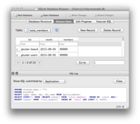

# Sqlitebrowser



## Description
DB Browser for SQLite is a high quality, visual, open source tool to create, design, and edit database files compatible with SQLite.

## Image
linuxserver/sqlitebrowser:latest

## Categories
- Uncategorized Services

## Ports
- 3000:3000/tcp
- 3001:3001/tcp

## Volumes
| Container | Bind |
|-----------|------|
| /config | /opt/appdata/sqlitebrowser |

## Environment Variables
| Name | Label | Default | Description |
|------|-------|---------|-------------|
| PUID | PUID | ```1024``` | ```for UserID``` |
| PGID | PGID | ```100``` | ```for GroupID``` |
| TZ | TZ | ```Europe/Amsterdam``` | ```specify a timezone to use, see this [list](https://en.wikipedia.org/wiki/List_of_tz_database_time_zones#List).``` |

## Labels
| Key | Value |
|-----|-------|
| traefik.enable | ```true``` |
| traefik.http.routers.sqlitebrowser.rule | ```Host(`sqlitebrowser.{$TRAEFIK_INGRESS_DOMAIN}`)``` |
| traefik.http.routers.sqlitebrowser.entrypoints | ```https``` |
| traefik.http.services.sqlitebrowser.loadbalancer.server.port | ```3000``` |
| traefik.http.routers.sqlitebrowser.tls | ```true``` |
| traefik.http.routers.sqlitebrowser.tls.certresolver | ```default``` |
| traefik.http.routers.sqlitebrowser.middlewares | ```traefik-forward-auth``` |
| mafl.enable | ```true``` |
| mafl.title | ```Sqlitebrowser``` |
| mafl.description | ```DB Browser for SQLite is a high quality, visual, open source tool to create, design, and edit database files compatible with SQLite.``` |
| mafl.link | ```https://sqlitebrowser.{$TRAEFIK_INGRESS_DOMAIN}``` |
| mafl.icon.wrap | ```true``` |
| mafl.icon.color | ```#007acc``` |
| mafl.status.enabled | ```true``` |
| mafl.status.interval | ```60``` |
| mafl.group | ```Services``` |
| mafl.icon.url | ```https://raw.githubusercontent.com/linuxserver/docker-templates/master/linuxserver.io/img/sqlitebrowser-banner.png``` |

