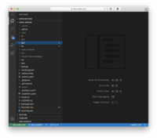

# code-server



## Description
Code\-server (https://coder.com) is VS Code running on a remote server, accessible through the browser. \- Code on your Chromebook, tablet, and laptop with a consistent dev environment. \- If you have a Windows or Mac workstation, more easily develop for Linux. \- Take advantage of large cloud servers to speed up tests, compilations, downloads, and more. \- Preserve battery life when you're on the go. \- All intensive computation runs on your server. \- You're no longer running excess instances of Chrome.

## Image
linuxserver/code-server:latest

## Categories
- Development

## Ports
- 8443:8443/tcp

## Volumes
| Container | Bind |
|-----------|------|
| /config | /opt/appdata/code-server |

## Environment Variables
| Name | Label | Default | Description |
|------|-------|---------|-------------|
| PUID | PUID | ```1000``` | ```for UserID``` |
| PGID | PGID | ```1000``` | ```for GroupID``` |
| TZ | TZ | ```Europe/Amsterdam``` | ```specify a timezone to use``` |
| PASSWORD | PASSWORD | ```password``` | ```Optional web gui password, if `PASSWORD` or `HASHED_PASSWORD` is not provided, there will be no auth.``` |
| HASHED_PASSWORD | HASHED_PASSWORD | `````` | ```Optional web gui password, overrides `PASSWORD`, instructions on how to create it is below.``` |
| SUDO_PASSWORD | SUDO_PASSWORD | ```password``` | ```If this optional variable is set, user will have sudo access in the code-server terminal with the specified password.``` |
| SUDO_PASSWORD_HASH | SUDO_PASSWORD_HASH | `````` | ```Optionally set sudo password via hash (takes priority over `SUDO_PASSWORD` var). Format is `$type$salt$hashed`.``` |
| PROXY_DOMAIN | PROXY_DOMAIN | ```code-server.my.domain``` | ```If this optional variable is set, this domain will be proxied for subdomain proxying.``` |
| DEFAULT_WORKSPACE | DEFAULT_WORKSPACE | ```/config/workspace``` | ```If this optional variable is set, code-server will open this directory by default``` |

## Labels
| Key | Value |
|-----|-------|
| traefik.enable | ```true``` |
| traefik.http.routers.code-server.rule | ```Host(`code-server.{$TRAEFIK_INGRESS_DOMAIN}`)``` |
| traefik.http.routers.code-server.entrypoints | ```https``` |
| traefik.http.services.code-server.loadbalancer.server.port | ```8443``` |
| traefik.http.routers.code-server.tls | ```true``` |
| traefik.http.routers.code-server.tls.certresolver | ```default``` |
| traefik.http.routers.code-server.middlewares | ```traefik-forward-auth``` |
| mafl.enable | ```true``` |
| mafl.title | ```Code-server {shmolf}``` |
| mafl.description | ```Code-server (https://coder.``` |
| mafl.link | ```https://code-server.{$TRAEFIK_INGRESS_DOMAIN}``` |
| mafl.icon.wrap | ```true``` |
| mafl.icon.color | ```#007acc``` |
| mafl.status.enabled | ```true``` |
| mafl.status.interval | ```60``` |
| mafl.group | ```Development``` |
| mafl.icon.url | ```https://raw.githubusercontent.com/linuxserver/docker-templates/master/linuxserver.io/img/code-server-banner.png``` |

