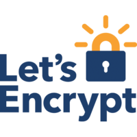

# letsencrypt / SWAG



## Description
This container sets up an Nginx webserver and reverse proxy with php support and a built\-in letsencrypt client that automates free SSL server certificate generation and renewal processes. It also contains fail2ban for intrusion prevention.

## Notes
Before running this container, make sure that the url and subdomains are properly forwarded to this container's host.* \- Port 443 on the internet side of the router should be forwarded to this container's port 443\.
* \- If you need a dynamic dns provider, you can use the free provider duckdns.org where the url will be yoursubdomain.duckdns.org and the subdomains can be www,ftp,cloud
* \- The container detects changes to url and subdomains, revokes existing certs and generates new ones during start.
* \- It also detects changes to the DHLEVEL parameter and replaces the dhparams file.
* \- If you'd like to password protect your sites, you can use htpasswd. Run the following command on your host to generate the htpasswd file `docker exec -it letsencrypt htpasswd -c /config/nginx/.htpasswd <username>`


## Image
linuxserver/swag:latest

## Categories
- Proxyserver

## Ports
- 80/tcp
- 443/tcp

## Volumes
| Container | Bind |
|-----------|------|
| /config | /opt/appdata/letsencrypt |

## Environment Variables
| Name | Label | Default | Description |
|------|-------|---------|-------------|
| EMAIL | EMAIL | `````` | `````` |
| URL | URL | `````` | `````` |
| SUBDOMAINS | SUBDOMAINS | `````` | `````` |
| ONLY_SUBDOMAINS | ONLY_SUBDOMAINS | `````` | `````` |
| DHLEVEL | DHLEVEL | `````` | `````` |
| PUID | PUID | ```1000``` | `````` |
| PGID | PGID | ```100``` | `````` |
| VALIDATION | VALIDATION | `````` | `````` |
| DNSPLUGIN | DNSPLUGIN | `````` | `````` |

## Labels
| Key | Value |
|-----|-------|
| traefik.enable | ```true``` |
| traefik.http.routers.letsencryptswag.rule | ```Host(`letsencryptswag.{$TRAEFIK_INGRESS_DOMAIN}`)``` |
| traefik.http.routers.letsencryptswag.entrypoints | ```https``` |
| traefik.http.services.letsencryptswag.loadbalancer.server.port | ```5299``` |
| traefik.http.routers.letsencryptswag.tls | ```true``` |
| traefik.http.routers.letsencryptswag.tls.certresolver | ```default``` |
| traefik.http.routers.letsencryptswag.middlewares | ```traefik-forward-auth``` |
| mafl.enable | ```true``` |
| mafl.title | ```Let's Encrypt / SWAG``` |
| mafl.description | ```This container sets up an Nginx webserver and reverse proxy with php support and a built-in letsencrypt client that automates free SSL server certificate generation and renewal processes.``` |
| mafl.link | ```https://letsencryptswag.{$TRAEFIK_INGRESS_DOMAIN}``` |
| mafl.icon.wrap | ```true``` |
| mafl.icon.color | ```#007acc``` |
| mafl.status.enabled | ```true``` |
| mafl.status.interval | ```60``` |
| mafl.group | ```Proxyserver``` |
| mafl.icon.url | ```https://raw.githubusercontent.com/Qballjos/portainer_templates/master/Images/letsencrypt.png``` |

