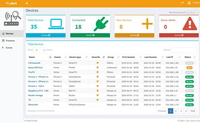

# pi.alert



## Description
WIFI / LAN intruder detector

## Image
jokobsk/pi.alert

## Categories
- Networkserver

## Ports
- 20211:20211/udp

## Volumes
| Container | Bind |
|-----------|------|
| /config | /opt/appdata/pi.alert |

## Environment Variables
| Name | Label | Default | Description |
|------|-------|---------|-------------|
| PUID | PUID | ```1000``` | `````` |
| PGID | PGID | ```100``` | `````` |

## Labels
| Key | Value |
|-----|-------|
| traefik.enable | ```true``` |
| traefik.http.routers.pi.alert.rule | ```Host(`pi.alert.{$TRAEFIK_INGRESS_DOMAIN}`)``` |
| traefik.http.routers.pi.alert.entrypoints | ```https``` |
| traefik.http.services.pi.alert.loadbalancer.server.port | ```9696``` |
| traefik.http.routers.pi.alert.tls | ```true``` |
| traefik.http.routers.pi.alert.tls.certresolver | ```default``` |
| traefik.http.routers.pi.alert.middlewares | ```traefik-forward-auth``` |
| mafl.enable | ```true``` |
| mafl.title | ```Pi.alert``` |
| mafl.description | ```WIFI / LAN intruder detector``` |
| mafl.link | ```https://pi.alert.{$TRAEFIK_INGRESS_DOMAIN}``` |
| mafl.icon.wrap | ```true``` |
| mafl.icon.color | ```#007acc``` |
| mafl.status.enabled | ```true``` |
| mafl.status.interval | ```60``` |
| mafl.group | ```Networkserver``` |
| mafl.icon.url | ```https://raw.githubusercontent.com/pucherot/Pi.Alert/main/docs/img/1_devices.jpg``` |

