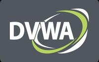

# red_vuln-dvwa



## Description
Damn Vulnerable Web App (DVWA) is a PHP/MySQL web application that is damn vulnerable

## Notes
Point your browser to http://your\-docker\-machine\-ip:8082 to access it. To start using: Generate DB from the web interface, Login using admin/password. Select DVWA Security in the left menu, set your difficulty level.

## Image
vulnerables/web-dvwa

## Categories
- Vulnerable
- Webserver

## Ports
- 8082:80/tcp

## Labels
| Key | Value |
|-----|-------|
| traefik.enable | ```true``` |
| traefik.http.routers.red_vuln-dvwa.rule | ```Host(`red_vuln-dvwa.{$TRAEFIK_INGRESS_DOMAIN}`)``` |
| traefik.http.routers.red_vuln-dvwa.entrypoints | ```https``` |
| traefik.http.services.red_vuln-dvwa.loadbalancer.server.port | ```80``` |
| traefik.http.routers.red_vuln-dvwa.tls | ```true``` |
| traefik.http.routers.red_vuln-dvwa.tls.certresolver | ```default``` |
| traefik.http.routers.red_vuln-dvwa.middlewares | ```traefik-forward-auth``` |
| mafl.enable | ```true``` |
| mafl.title | ```DVWA``` |
| mafl.description | ```Damn Vulnerable Web App (DVWA) is a PHP/MySQL web application that is damn vulnerable``` |
| mafl.link | ```https://red_vuln-dvwa.{$TRAEFIK_INGRESS_DOMAIN}``` |
| mafl.icon.wrap | ```true``` |
| mafl.icon.color | ```#007acc``` |
| mafl.status.enabled | ```true``` |
| mafl.status.interval | ```60``` |
| mafl.group | ```Vulnerable``` |
| mafl.icon.url | ```https://linuxsecurityblog.files.wordpress.com/2016/01/dvwa.jpg``` |

