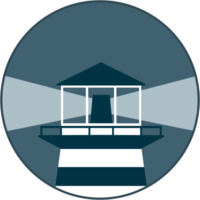

# watchtower



## Description
A container\-based solution for automating Docker container base image updates

## Notes
[Application documentation 🗗](https://containrrr.dev/watchtower/)

## Image
containrrr/watchtower

## Categories
- Docker

## Ports
- 9001/tcp

## Volumes
| Container | Bind |
|-----------|------|
| /var/run/docker.sock | /var/run/docker.sock |

## Labels
| Key | Value |
|-----|-------|
| traefik.enable | ```true``` |
| traefik.http.routers.watchtower.rule | ```Host(`watchtower.{$TRAEFIK_INGRESS_DOMAIN}`)``` |
| traefik.http.routers.watchtower.entrypoints | ```https``` |
| traefik.http.services.watchtower.loadbalancer.server.port | ```17442``` |
| traefik.http.routers.watchtower.tls | ```true``` |
| traefik.http.routers.watchtower.tls.certresolver | ```default``` |
| traefik.http.routers.watchtower.middlewares | ```traefik-forward-auth``` |
| mafl.enable | ```true``` |
| mafl.title | ```Watchtower {shmolf}``` |
| mafl.description | ```A container-based solution for automating Docker container base image updates``` |
| mafl.link | ```https://watchtower.{$TRAEFIK_INGRESS_DOMAIN}``` |
| mafl.icon.wrap | ```true``` |
| mafl.icon.color | ```#007acc``` |
| mafl.status.enabled | ```true``` |
| mafl.status.interval | ```60``` |
| mafl.group | ```Docker``` |
| mafl.icon.url | ```https://raw.githubusercontent.com/shmolf/portainer-templates/main/assets/logos/watchtower-logo.png``` |

