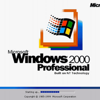

# win2000



## Description
A Docker image for Windows 2000 Advanced Server with SP4\.

## Notes
**Template created by Pi\-Hosted Series**  
**Check our Github page: [https://github.com/pi\-hosted/pi\-hosted](https://github.com/pi-hosted/pi-hosted)**  
  
**Official Webpage:** [https://github.com/hectorm/docker\-qemu\-win2000](https://github.com/hectorm/docker-qemu-win2000)  
**Official Docker Documentation:** [https://github.com/hectorm/docker\-qemu\-win2000\#start\-an\-instance](https://github.com/hectorm/docker-qemu-win2000#start-an-instance)  
  
  
**Youtube Video:** [Novaspirit Tech \- Checking out Windows 2000 Docker](https://www.youtube.com/watch?v=57Gnp0424Qc&list=PL846hFPMqg3jwkxcScD1xw2bKXrJVvarc&index=13)  
  
Why? Your scientists were so preoccupied with whether or not they could, that they didn't stop to think if they should. \-\- Dr. Ian Malcolm

## Image
hectorm/qemu-win2000:latest

## Categories
- Other
- Tools

## Ports
- 3389:3389/tcp
- 5900:5900/tcp
- 6080:6080/tcp

## Volumes
| Container | Bind |
|-----------|------|
| /mnt | /opt/appdata/win2000/zdrive |

## Labels
| Key | Value |
|-----|-------|
| traefik.enable | ```true``` |
| traefik.http.routers.win2000.rule | ```Host(`win2000.{$TRAEFIK_INGRESS_DOMAIN}`)``` |
| traefik.http.routers.win2000.entrypoints | ```https``` |
| traefik.http.services.win2000.loadbalancer.server.port | ```3389``` |
| traefik.http.routers.win2000.tls | ```true``` |
| traefik.http.routers.win2000.tls.certresolver | ```default``` |
| traefik.http.routers.win2000.middlewares | ```traefik-forward-auth``` |
| mafl.enable | ```true``` |
| mafl.title | ```Windows 2000``` |
| mafl.description | ```A Docker image for Windows 2000 Advanced Server with SP4.``` |
| mafl.link | ```https://win2000.{$TRAEFIK_INGRESS_DOMAIN}``` |
| mafl.icon.wrap | ```true``` |
| mafl.icon.color | ```#007acc``` |
| mafl.status.enabled | ```true``` |
| mafl.status.interval | ```60``` |
| mafl.group | ```Other``` |
| mafl.icon.url | ```https://raw.githubusercontent.com/pi-hosted/pi-hosted/master/images/win2000.png``` |

