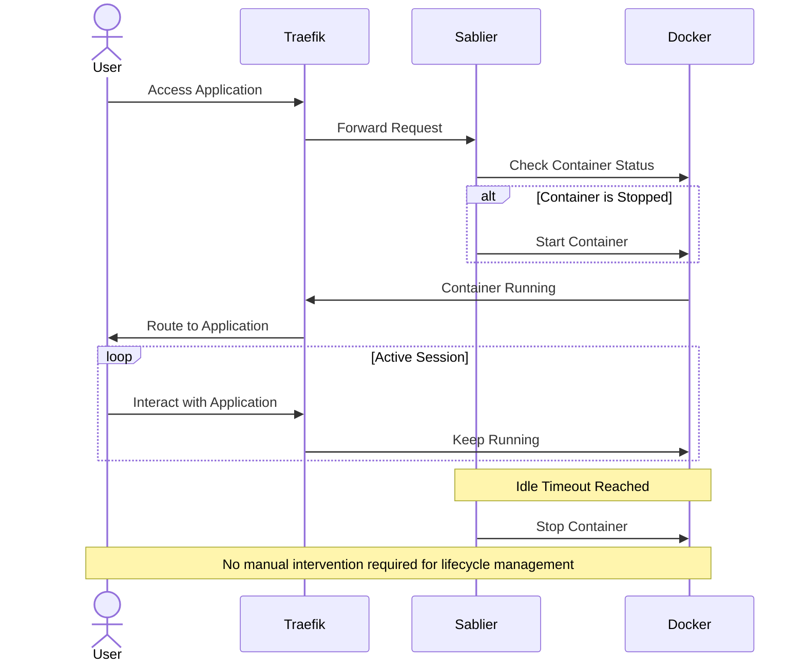

# Start and Stop Containers On-Demand with Sablier

[Sablier](https://github.com/sablierapp/sablier) is a tool that helps you automatically manage your Docker containers by starting them on demand and shutting them down when they're inactive. This is particularly useful for applications that are used infrequently, such as those accessed only once a week, helping you conserve resources and prevent unnecessary load on your lab environment.


## Architecture

Sablier runs as a Docker container and is included by default as part of the lab-core infrastructure. It integrates with Traefik through a middleware configuration to manage container lifecycle. While Sablier uses Docker labels to identify which containers should be managed for on-demand startup and shutdown, it also requires static file configuration. This additional configuration is necessary because Traefik removes container information when containers are stopped, meaning the label-based configuration alone is insufficient to maintain the routing rules needed to trigger container startup.

```mermaid
graph TD
    A[User Request to Access Application] --> B[Traefik]
    B -->|Middleware Configuration| C[Sablier]
    C -->|Checks Static File Config| D[Docker Containers]
    D --> E{Container Status}
    
    E -->|If Stopped| F[Start Container]
    F --> G[Application Running]
    E -->|If Running| G

    G -->|Route to Application| B
    B -->|Forward Request| H[User Receives Application Response]

    subgraph lab-core Infrastructure
        B
        C
        D
    end

    %% Additional notes
    classDef note fill:#333,stroke:#333,stroke-width:2px;
    note1("Sablier uses Docker labels for container lifecycle management but relies on a static file configuration due to Traefik's removal of stopped container info."):::note
    C --- note1
```




## Configuration

To enable Sablier management for a container, add these Docker labels to its configuration:

```
    labels:
      - sablier.enable=true
      - sablier.group=default
```

:::info
Note: Make sure to add your containers to the "web" network so they can communicate with other services. 
:::


Also it's required to create a dynamic configuration for Traefik for example:

::: code-group
```yaml [services/traefik/conf.d/code-server.yaml]
http:
  # Middleware configurations
  middlewares:
    # Sablier middleware for managing code-server container lifecycle
    sablier-dynamic-code-server:
      plugin:
        sablier:
          group: default               # Container group for management
          names: lab-code-server       # Container name to manage
          dynamic:
            displayName: Code Server   # Display name shown in UI
            refreshFrequency: 5s       # How often to check container status
            showDetails: "true"        # Show detailed status in UI
            theme: ghost               # UI theme
          sablierUrl: http://sablier:10000 # URL of Sablier service
          sessionDuration: 5m          # How long to keep container running
    
    # Strip prefix middleware to remove path prefix
    code-server-strip-prefix:
      stripPrefix:
        prefixes:
          - "/labs/code-server/"
    
    # Redirect middleware to ensure trailing slash
    code-redirect:
      redirectRegex:
        regex: "^(.*)/labs/code-server$$"
        replacement: "${1}/labs/code-server/"
  
  # Service definition for code-server
  services:
    code-server:
      loadBalancer:
        servers:
          - url: "http://lab-code-server:8443" # Internal service URL
  
  # Router configuration for code-server
  routers:
    code-server:
      # Route matching rule in this case
      rule: PathPrefix(`/labs/code-server`) 
      entryPoints:
        - "https"                     # Only allow HTTPS access
      middlewares:                    # Applied middlewares in order
        - sablier-dynamic-code-server@file
        - code-server-strip-prefix@file
        - code-redirect@file
        - traefik-forward-auth@docker
      service: "code-server"
      priority: 100                   # Router priority
      tls:
        certResolver: default         # Use default cert resolver

```
:::

:::info
For Traefik dynamic configuration changes, you do not need to restart the Traefik Docker container. Traefik automatically detects and applies configuration changes on-the-fly through its dynamic configuration providers. The changes will take effect immediately after saving the configuration file.
:::

## Using your Sablier-enabled application

Simply visit the application URL (in this case `https://$LAB_DOMAIN/labs/code-server`)

   1. Sablier will display a welcome screen while it starts up the container
   2. Once the container is ready, you'll be automatically redirected to your application
   3. The container will remain running for the configured session duration (5 minutes in this example)
   4. After the session expires, the container will be stopped until the next access

## Container Lifecycle Management



The container is automatically managed by Sablier:
   - Started on-demand when accessed
   - Kept running during active sessions  
   - Stopped after the configured idle timeout
   - No manual intervention required

:::tip
Sablier provides efficient resource usage by only running containers when they're actually being used.
:::