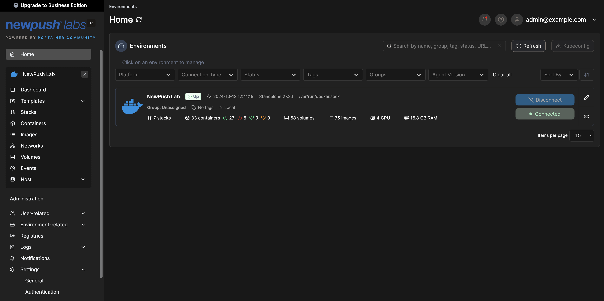
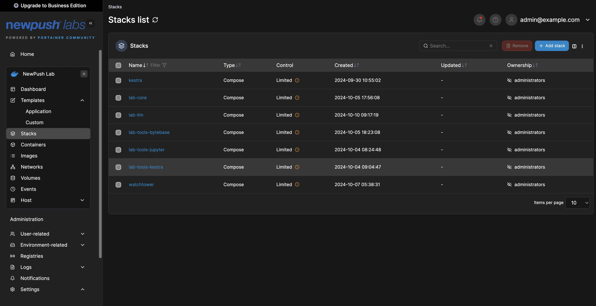
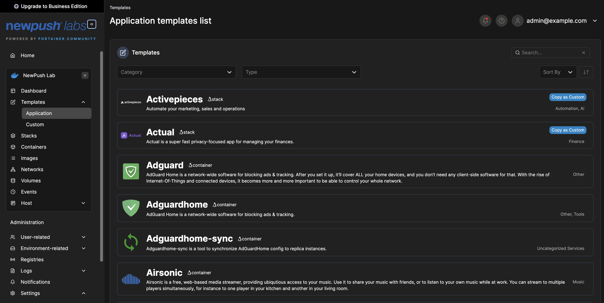

# Application Templates with Portainer

NewPush Labs utilizes Portainer to provide pre-configured application templates, enabling quick deployment and management of containerized applications. 

## Features

- Wide range of pre-configured application templates
- Easy deployment with **just** a few clicks
- Customizable templates to suit your needs
- Integration with NewPush Labs' services

## Accessing Portainer

Portainer can be accessed at `https://portainer.DOMAIN`. Log in with your default username and password. Once logged in, select your docker host (which is your lab) and explore the running docker stack in detail.

## Configuration

Portainer is pre-configured to the fullest extent possible with the lab deployment. Additional options can be configured in the admin area via the UI.

Follow this [guide](/guides/tutorials/enable-sso-portainer-casdoor.html) to configure SSO. 

The end-user documentation for Portainer is available [here](https://docs.portainer.io/user/docker/dashboard)

## Application Templates

Portainer application templates are a powerful feature that allows users to quickly deploy and manage containerized applications with ease. These templates come pre-configured with the necessary settings to ensure seamless integration and operation within the lab environment.

:::tip

NewPush Labs offers an extensive collection of 500+ prebuilt application templates, covering a wide range of applications and services. These templates are designed to simplify the deployment process in the lab environment. 

Learn more about it at the [newpush-labs-template-server](https://github.com/newpush-labs/newpush-labs-template-server) repository.

:::

### Usage

To deploy an application using a template, log in to Portainer and navigate to the "App Templates" section. Browse or search for the desired application, then click on the application to view its details. Configure any necessary settings under advanced, and finally, click "Deploy the container" to launch the application.
   

### Custom Labels

Portainer templates for the labs come with MAFL icons and Traefik configuration pre-integrated. It is important to review these configurations before deployment to ensure they meet your specific requirements. The MAFL icons provide a visual representation of the applications, while the Traefik configuration ensures proper routing and security for your deployed services.

## Best Practices

When deploying workloads to the lab, it is essential to follow best practices to ensure smooth operation, security, and maintainability. 

Here are some key best practices to consider:

- Review the template configuration before deployment
- Use environment variables for sensitive information
- Regularly update your deployed applications
- Monitor resource usage of deployed applications

:::warning
By default, port mappings are not removed, so ensure you do not unintentionally expose services to the internet.
:::