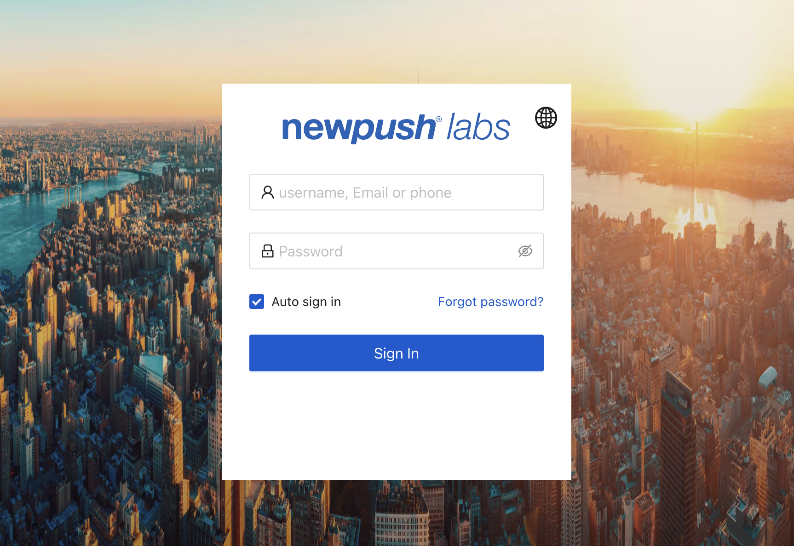
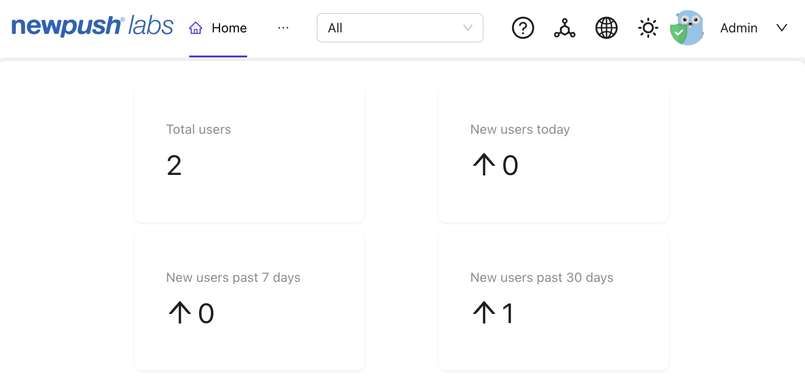

# Single Sign-On (SSO) with Casdoor

At NewPush Labs, our lab environments come equipped with an integrated identity provider that supports OAuth. This allows you to seamlessly manage user authentication and authorization within your lab projects. 


## Features

NewPush Labs leverages Casdoor as its identity provider to offer a robust and flexible Single Sign-On (SSO) solution. Casdoor is an open-source identity and access management (IAM) platform that supports various authentication protocols, including OAuth, OIDC, SAML, and CAS. By integrating Casdoor, we ensure that you can manage user authentication and authorization efficiently and securely.



## Configuration 

In the default installation of NewPush Labs, Casdoor will be accessible under the `auth.` subdomain. This means that all authentication and authorization requests will be directed to `auth.yourdomain.com`, where `yourdomain.com` is the domain of your lab environment. This setup ensures a clear separation of authentication services from other lab services, enhancing security and manageability.

::: tip
 Casdoor supports multiple authentication protocols, making it highly versatile for various use cases. Whether you need OAuth for modern web applications, SAML for enterprise solutions, or CAS for legacy systems, Casdoor has you covered. This flexibility ensures that you can integrate Casdoor into a wide range of projects with ease.
:::
 
 ## Rotate credentials
 
Rotating OAuth secrets is a crucial aspect of maintaining the security of your lab environment. With Casdoor, you can easily rotate these secrets via the command line using the `casdoor-rotate-secrets.py` script. This script automates the process of generating new secrets and updating them in your Casdoor configuration, ensuring that your authentication mechanisms remain secure without manual intervention.

To use the `casdoor-rotate-secrets.py` script, follow these steps:

1. Open your terminal and navigate to the directory where the script is located.
2. Run the script with the necessary parameters, such as your Casdoor instance URL and admin credentials:
   ```sh
   python casdoor-rotate-secrets.py --db casdoor.db --rotate
   ```
3. The script will generate new OAuth secrets and update them in your Casdoor configuration automatically.

By regularly rotating your OAuth secrets, you can minimize the risk of unauthorized access when you cloned your environment.

