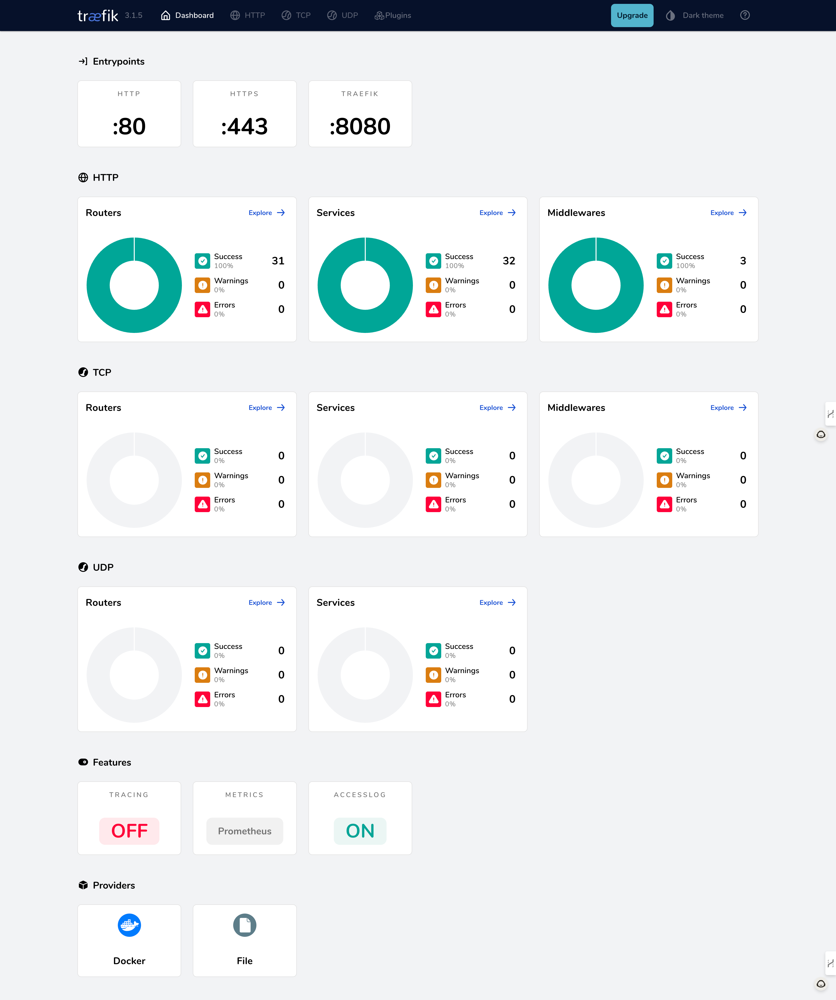
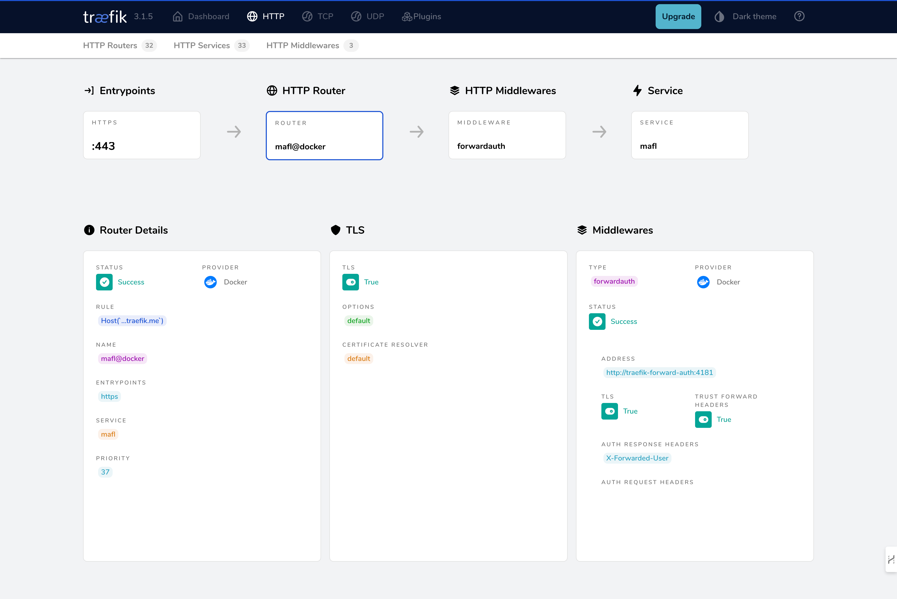
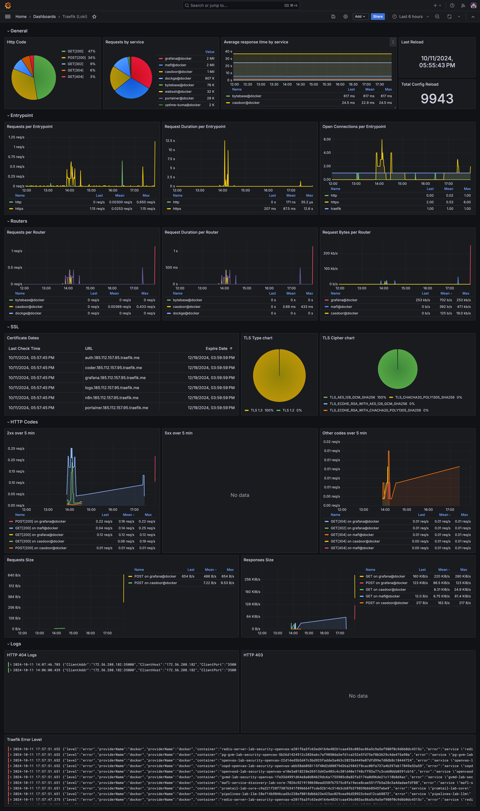

# Ingress Controller with Traefik

NewPush Labs employs Traefik as its ingress controller, offering advanced routing capabilities, SSL certificate provisioning, and authentication middleware. 



## Features

The lab comes with a preconfigured Traefik setup that is designed to work out-of-the-box with minimal configuration. This setup includes default routing rules, SSL certificate management, and integration with NewPush Labs' authentication services. The preconfigured Traefik instance ensures that your services are securely exposed and easily accessible.

- Automatic SSL certificate provisioning and renewal
- Dynamic routing based on hostnames and paths
- Integration with authentication services
- Load balancing and traffic distribution
- Middleware support for additional functionality
- Web UI for visualizing entrypoints and routes

## Configuration

Traefik in NewPush Labs is preconfigured to work seamlessly with other components. However, you can customize its behavior by modifying the Traefik configuration files.

```bash
$LAB_HOME/services/traefik/traefik.yaml
```

After making changes to `traefik.yaml`, you need to restart the Traefik Docker container:

```bash
docker restart traefik
```

By default, Traefik logs are ingested into Loki.

For detailed information on Traefik configuration, refer to the [official Traefik documentation](https://doc.traefik.io/traefik/).


## Expose Services

To expose a new service through Traefik, you typically need to:

- Define the service in your Docker Compose file
- Add appropriate labels or annotations to configure routing rules
- Ensure the service is part of the Traefik network called: `web`  

Example Docker Compose service with Traefik labels:

```yaml
services:
  myapp:
    image: myapp:latest
    labels:
      - "traefik.enable=true"
      - "traefik.http.routers.myapp.rule=Host(`myapp.yourdomain.com`)"
      - "traefik.http.routers.myapp.entrypoints=websecure"
      - "traefik.http.routers.myapp.tls=true"
    newtorks:
      - web
  networks:
    web:
      external: True
```

This configuration will make your app available at `https://myapp.yourdomain.com`.

To ensure user authentication before accessing the backend service via Casdoor, include the following label:

```yaml
services:
  myapp:
    labels:
      - "traefik.http.routers.webssh.middlewares=traefik-forward-auth"
```

This middleware ensures that users are authenticated through Casdoor.

After successful configuration, the service will be displayed on the dashboard:



## Monitoring

NewPush Labs offers a preconfigured monitoring solution with Grafana, featuring dashboards for system and application metrics, including Traefik-specific metrics. Grafana integrates with Loki to view and analyze Traefik logs, providing a unified interface for monitoring metrics and logs, making it easier to troubleshoot issues.

