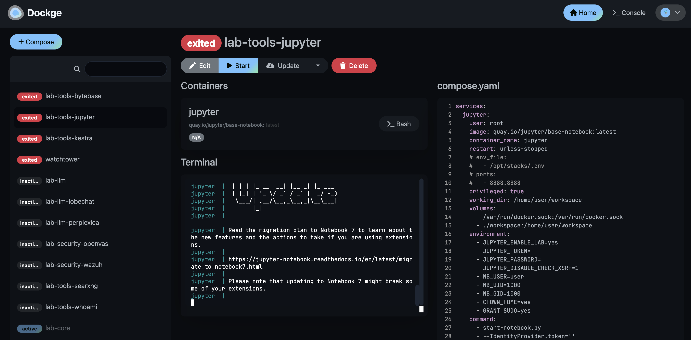

# Lab Stacks with Dockge

NewPush Labs is designed with a modular and extensible architecture, allowing for easy customization and expansion of the lab environment. For managing these docker compose files we use Dockge which provides a clutterless web UI for it. It also gives instant insights into how a stack is built and allows it to be edited directly from the browser.



## Features 

The lab includes default stacks that enhance productivity and provide insights into various domains such as programming, data science, cybersecurity, large language models, and more.

These stacks are designed for easy deployment and configuration, enabling users to swiftly set up their preferred environments and begin their projects with minimal effort. 

Additionally, the lab offers opportunities for collaborative identification and implementation of new lab environments. Users can work together to propose, design, and deploy custom stacks tailored to their specific needs, fostering a community-driven approach to lab development and innovation.

## Management

Dockge can be accessed at `https://dockge.DOMAIN`. It provides a web UI for managing docker compose files, but you can also use the traditional CLI approach for managing your containers.

### Docker Compose

```bash
# The following directory contains the stacks. Each directory is a stack.
cd $LAB_HOME/services/dockge/stacks/

# Enter a directory such as lab-tools-jupyter 
cd lab-tools-jupyter 

# And you can use docker compose to start a stack in the background:
docker compose -p lab-tools-jupyter up -d 
```

### CLI with newpush-lab

```bash
# Start the lab-tools-jupyter stack with the newpush-lab shell command:
newpush-lab start lab-tools-jupyter

```

## Configuration

Dockge can be configured using environment variables. It comes with sensible defaults, so no additional configuration is necessary.


## How it works?

NewPush Labs utilizes a modular approach to container management, dividing the environment into three distinct container definitions:


### Core Containers

The core containers include the essential services required for the lab environment to function. These services are critical and are always running. They include:

- **Ingress Controller**: Manages incoming traffic and routes it to the appropriate services.
- **Authentication**: Provides Single Sign-On (SSO) capabilities and user management.
- **Monitoring**: Collects and visualizes metrics and logs from the lab environment.

### Lab Stacks

Lab stacks are modular and can be started or stopped independently from the core services. This allows for flexibility in managing different environments and workloads. Each lab stack can be tailored to specific use cases or projects. Examples of lab stacks include:

- **Development Environments**: Containers for development tools and applications.
- **Testing Environments**: Containers for running automated tests and CI/CD pipelines.
- **Custom Applications**: User-defined applications and services that are not part of the core infrastructure.

### Single Images

Portainer provides a user-friendly interface for managing individual containers and docker stacks. Users can deploy single images or predefined stacks directly from the Portainer UI. This approach is ideal for quickly deploying and managing containerized applications without the need for extensive configuration.

- **Single Images**: Deploy individual containers for specific applications or services.
- **Docker Stacks**: Deploy multi-container applications using docker-compose files.

By leveraging these three container definitions, NewPush Labs ensures a flexible, scalable, and easy-to-manage lab environment that can adapt to various needs and use cases.


## Key Differences

While both application templates and lab stacks provide ways to deploy and manage containerized applications, there are key differences between the two:

- **Application Templates**: These are pre-configured templates available in Portainer that allow for quick deployment of individual applications or services. They are designed for ease of use and can be deployed with minimal configuration. Application templates are ideal for users who need to quickly deploy and manage single applications without worrying about complex dependencies.

- **Lab Stacks**: Lab stacks, on the other hand, are maintained in the repository as complex environments consisting of multiple applications. They are modular and can be started or stopped independently from the core services. Lab stacks are tailored to specific use cases or projects and can include development environments, testing environments, and custom applications. They provide a more flexible and scalable approach to managing containerized applications, allowing for greater customization and control over the lab environment.

By understanding these differences, users can choose the appropriate method for deploying and managing their containerized applications based on their specific needs and requirements.
