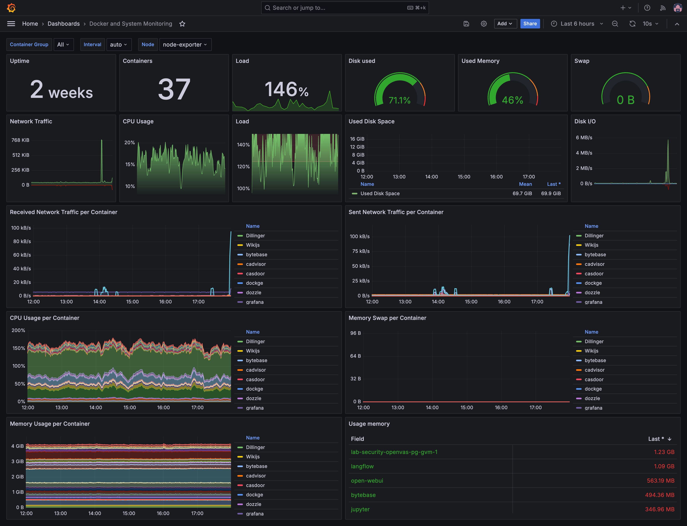
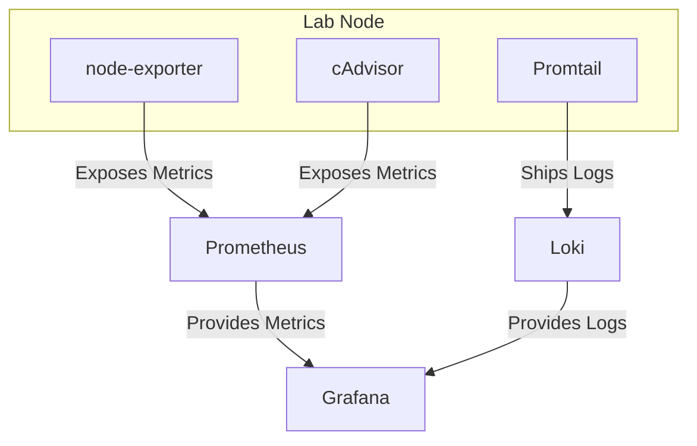
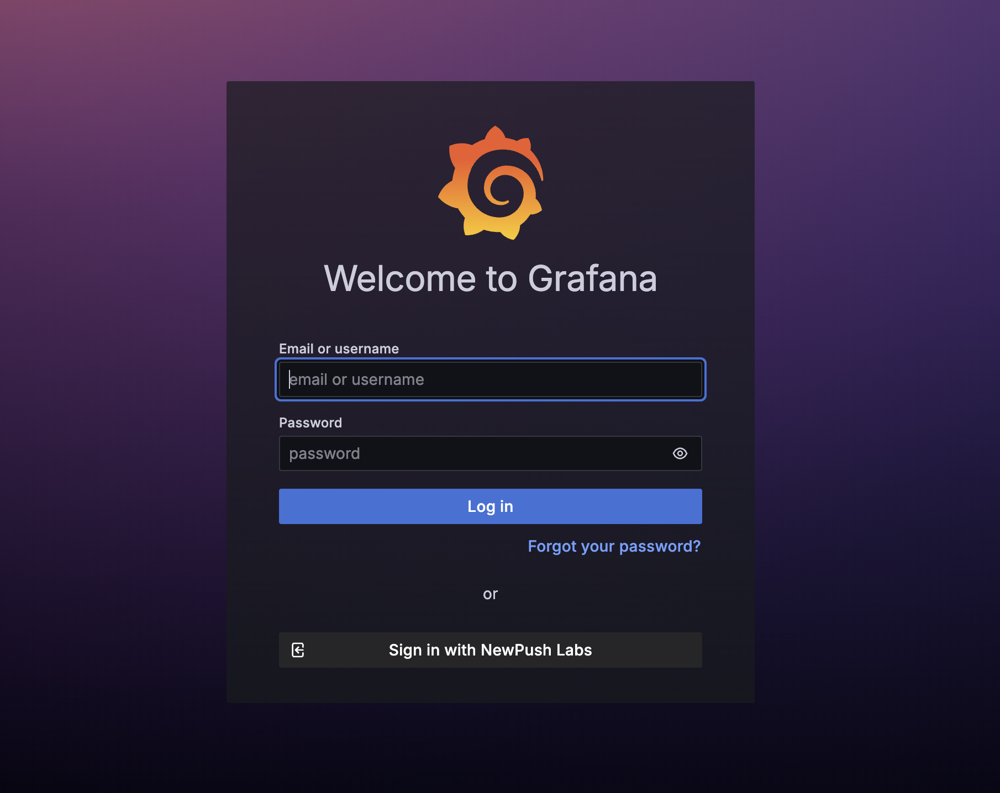
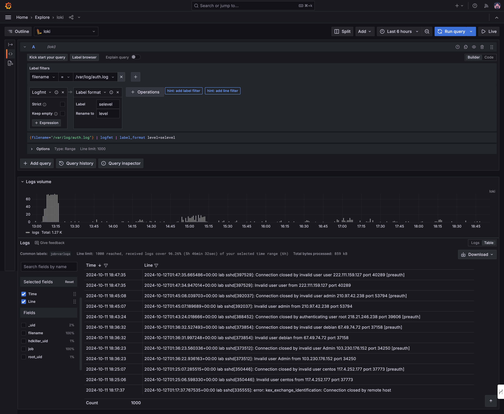

# Monitoring

NewPush Labs includes a comprehensive and pre-configured monitoring solution using [Grafana](https://grafana.com/) for visualization, [Loki](https://grafana.com/oss/loki/) for log aggregation and analysis, [cAdvisor](https://github.com/google/cadvisor) for container monitoring, [Prometheus](https://prometheus.io/) for metrics collection, [node-exporter](https://github.com/prometheus/node_exporter) for exporting system host metrics, and [Promtail](https://grafana.com/docs/loki/latest/clients/promtail/) for log shipping. 

It's comes with customized dashboards for visualize metrics from various sources.



## Architecture Diagram
The following diagram illustrates the components and their interactions within the monitoring stack:



## Grafana 

Grafana is an open-source platform for monitoring and observability. It allows you to query, visualize, alert on, and understand your metrics. Grafana integrates with various data sources, enabling you to create customizable dashboards for monitoring your applications and infrastructure.

### Features

- Pre-configured with authentication, dashboards, and additional features
- Data sources are automatically added during deployment
- Includes ready-to-use dashboards for both system and application metrics
- Provides alerting functionalities if needed
- Easily extendable to monitor additional services and applications

### Accessing Grafana
Grafana can be accessed at `https://grafana.DOMAIN`. By default, it is protected by Traefik's forward-auth middleware to prevent exposure to the internet accidentally. Additionally, it is configured to use SSO by default. Click on "Sign in with NewPush lab" to log in.



::: tip

You can disable the login window and enable automatic sign-in via SSO by setting the following environment variable for the Grafana container:
  
```
GF_AUTH_GENERIC_OAUTH_AUTO_LOGIN=true
```

:::

### Configuration

The core configuration of Grafana in NewPush Labs is managed via Docker labels. This ensures that essential settings, such as data sources and dashboards, are automatically applied during deployment. You are also able to configure additional settings via the web UI for those settings which are not defined via Docker labels.

Grafana allows you to add data sources and dashboards via the UI by default. This provides flexibility in configuring your monitoring setup without needing to modify configuration files directly.

## Loki

Loki is a log aggregation system that integrates with Grafana for efficient log storage and visualization. It is cost-effective, scalable, and suitable for large deployments, providing quick insights into system and application performance.


### Features

- Efficient log storage and indexing
- Integration with Grafana for log visualization
- Powerful query language (LogQL) for searching and analyzing logs


### Accessing Loki

Loki is seamlessly integrated with Grafana, enabling you to query and visualize logs directly within the Grafana interface. Ensure you select the correct data source when exploring your data.




### Configuration
Please refer to Loki's documentation for additional reference. Logs ingested to Loki via Promtail.

You can find the configuration in ```$LAB_HOME/services/loki/local-config.yaml```:

```yaml
auth_enabled: false

server:
  http_listen_port: 3100

common:
  path_prefix: /loki
  storage:
    filesystem:
      chunks_directory: /loki/chunks
      rules_directory: /loki/rules
  replication_factor: 1
  ring:
    kvstore:
      store: inmemory

schema_config:
  configs:
    - from: 2020-10-24
      store: boltdb-shipper
      object_store: filesystem
      schema: v11
      index:
        prefix: index_
        period: 24h

ruler:
  alertmanager_url: http://localhost:9093

analytics:
 reporting_enabled: false

query_scheduler:
  max_outstanding_requests_per_tenant: 4096

frontend:
  max_outstanding_per_tenant: 4096

query_range:
  parallelise_shardable_queries: true

limits_config:
  split_queries_by_interval: 15m
  max_query_parallelism: 32
```

## Promtail

Promtail is an agent that ships the contents of local logs to a private Grafana Loki instance or Grafana Cloud. It is usually deployed to every machine that has applications needed to be monitored.

### Features

- Lightweight log collector
- Supports various log formats
- Integrates seamlessly with Loki
- Can be configured to scrape logs from multiple sources

### Configuration

Promtail can be configured using a YAML file. The configuration file defines how Promtail will scrape logs from the system and send them to Loki. 

To ingest additional log sources into Loki, you need to edit the Promtail configuration file. Below is an example of how to add a new log source to Promtail.

Please refer to [Promtail's documentation](https://grafana.com/docs/loki/latest/send-data/promtail/configuration/#example-static-config) for more details.

You can find the configuration of Promtail in ```$LAB_HOME/services/promtail/config.yaml```:

```yaml
server:
  http_listen_port: 9080
  grpc_listen_port: 0

positions:
  filename: /tmp/positions.yaml

clients:
  - url: http://loki:3100/loki/api/v1/push

scrape_configs:
  - job_name: system
    static_configs:
      - targets:
          - localhost
        labels:
          job: varlogs
          __path__: /var/log/*log

  - job_name: traefik       // [!code ++]
    static_configs:         // [!code ++]
      - targets:            // [!code ++]
          - traefik         // [!code ++]
        labels:             // [!code ++]
          job: traefik      // [!code ++]
          __path__: /var/log/traefik/*log  // [!code ++]
```


::: tip

Don't forget to restart Promtail after altering the log file with the following command:

```bash
docker restart promtail
```

:::

## Prometheus

Prometheus is an open-source systems monitoring and alerting toolkit. It is designed for reliability and scalability, making it suitable for both small and large-scale deployments. Prometheus collects and stores metrics as time series data, providing powerful querying capabilities.

### Features

- Multi-dimensional data model with time series data identified by metric name and key/value pairs
- Flexible query language (PromQL) to leverage this dimensionality
- No reliance on distributed storage; single server nodes are autonomous
- Time-based data retention and efficient storage
- Built-in support for service discovery or static configuration for monitoring targets
- Alerting based on the collected metrics

### Accessing Prometheus

Prometheus can be accessed at `http://prometheus.DOMAIN`. By default, it is protected by Traefik's forward-auth middleware to prevent exposure to the internet accidentally. Additionally, it is configured to use SSO by default. Click on "Sign in with NewPush lab" to log in.

### Configuration

Prometheus is configured using a YAML file. The configuration file defines how Prometheus will scrape metrics from the system and other services. Below is an example of a basic Prometheus configuration file.

You can find the configuration of Prometheus in ```$LAB_HOME/services/prometheus/prometheus.yaml```:

```yaml

global:
  scrape_interval: 15s
  evaluation_interval: 15s

scrape_configs:
  - job_name: 'prometheus'
    static_configs:
      - targets: ['localhost:9090']

  - job_name: 'node_exporter'
    static_configs:
      - targets: ['node-exporter:9100']

  - job_name: 'loki'
    static_configs:
      - targets: ['loki:3100']

  - job_name: 'cadvisor'
    static_configs:
      - targets: ['cadvisor:8080']

  - job_name: 'traefik'
    static_configs:
      - targets: ['traefik:8080']
```


::: tip

Don't forget to restart Prometheus after altering the log file with the following command:

```bash
docker restart prometheus
```

:::
