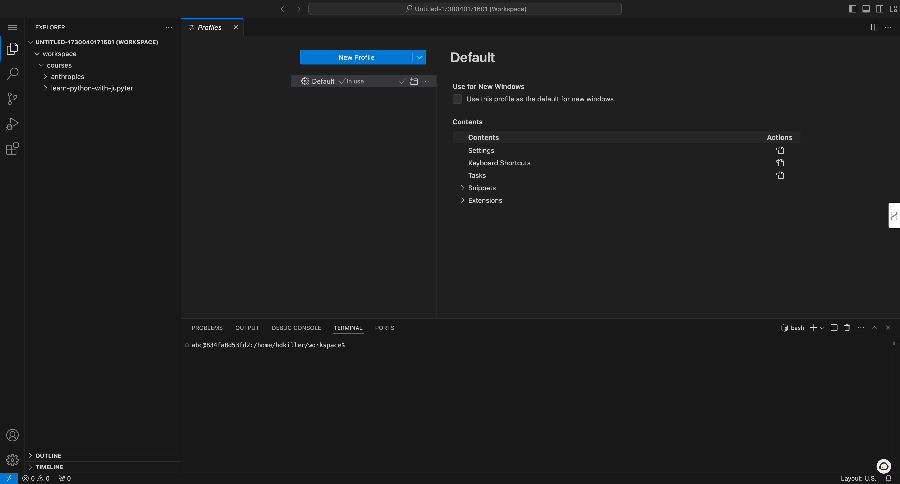

# Visual Studio Code in Browser

NewPush Labs provides a browser-based Visual Studio Code environment, offering a familiar development experience with full IDE capabilities directly in your web browser.

## Features

The lab comes with a preconfigured VS Code setup that includes essential extensions and configurations. This browser-based IDE provides the same powerful features you'd expect from the desktop version:

- Full syntax highlighting and IntelliSense
- Integrated terminal access
- Git integration
- Extension support
- File system access
- Collaborative features
- Customizable workspace settings
- Remote development capabilities

### Accessing Visual Studio Code

Visual Studio Code can be accessed via browser at https://DOMAIN/labs/code-server

To efficiently manage resources, we utilize Sablier and its Traefik plugin to automatically spawn and terminate the VSCode container based on usage.

The instance is secured through Casdoor authentication, and to optimize resource usage, it automatically shuts down after a period of inactivity.

## Configuration

VS Code in NewPush Labs is preconfigured with common development tools and extensions. However, you can customize your environment by installing additional extensions or modifying settings through the UI.

Settings and extensions are persisted across sessions in your user directory.

