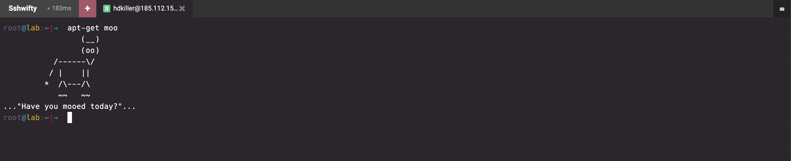

# Web-Based Terminal with Sshwifty

NewPush Labs provides a secure web-based terminal for SSH access to your lab environment.


## Features

- Browser-based SSH access
- Integration with Casdoor for secure authentication
- Support for multiple concurrent sessions
- Customizable terminal settings

## Accessing the Web Terminal

The web-based terminal is accessible at `https://sshwifty.DOMAIN`. Use your SSO credentials to log in.

## Usage

By default, the web terminal is preconfigured to connect to the core services of the lab environment. This ensures that you have immediate access to essential services without additional setup. 

1. Log in to the web terminal interface
2. Select the server you want to connect to
3. Use the terminal as you would a regular SSH session

## Configuration

The config file for sshwifty located at `$LAB_HOME/services/sshwifty/sshwift.conf.json` 

::: tip

Don't forget to restart sshwifty after altering the log file with the following command:

```bash
docker restart sshwifty
```

:::
