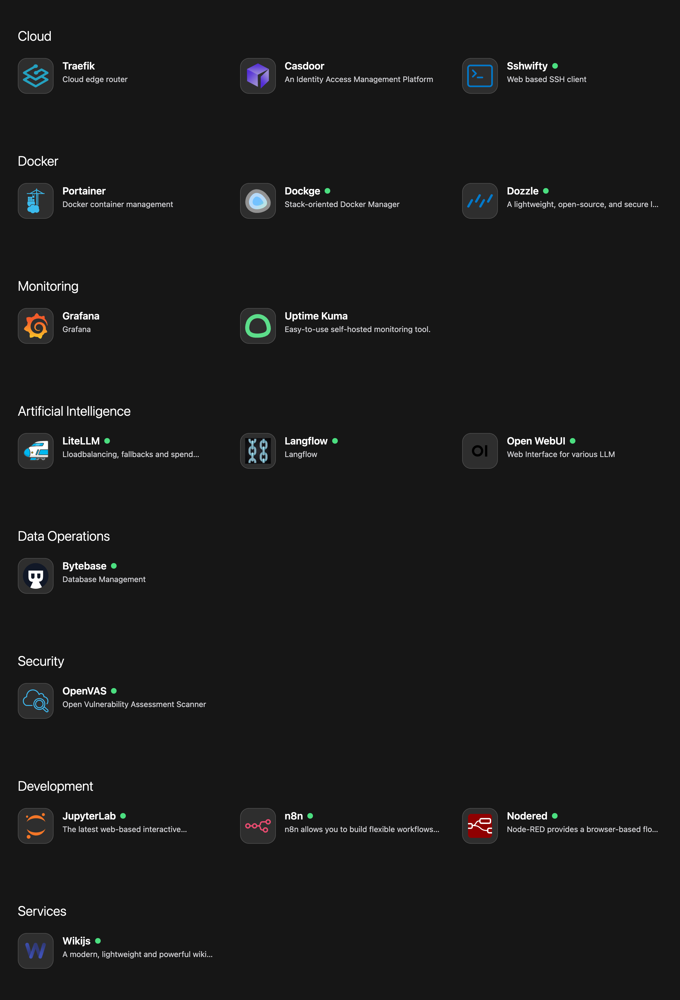

# Application launcher 

NewPush Labs provides a sleek and intuitive web-based user interface for managing your lab environment. The dashboard is based on mafl, and we created an automatic service discovery for it, which is based on Docker labels. 

 


## Features

- Dashboard overview of your lab environment
- Easy navigation to all lab services
- Mobile-responsive design for management on the go
- Integration with SSO for secure access


## Accessing the Web UI

The main Web UI is accessible at `https://www.DOMAIN`. Use your SSO credentials to log in, since it's protected by Casdoor using a Traefik Middleware.

::: tip
Mafl can be added to your mobile phone since it's a Progressive Web App (PWA). This allows you to have a native app-like experience directly from your mobile browser. Once added, you can access mafl just like any other app on your mobile device.
:::


## Configuration

The Web UI can be customized to suit your specific needs. The `mafl-service-discovery` container will extend the following file:

```bash
 $LAB_HOME/services/mafl/base.yaml
```

## Example 

The following is an example `base.yaml`. You can add your own app icons as well, even if those are not hosted in your lab.

::: code-group

```yaml [base.yaml]
title: newpush labs
theme: dark
layout:
  grid:
    small: 2
    medium: 2
    large: 3
    xlarge: 4
services:
  Cloud:
    - title: Traefik
      description: Cloud edge router
      link: 'https://traefik.${DOMAIN}'
      icon:
        name: devicon:traefikproxy
        wrap: true
```

:::

For detailed documentation on various customizations such as themes, icons, etc., please refer to the [mafl documentation](https://mafl.hywax.space/).
