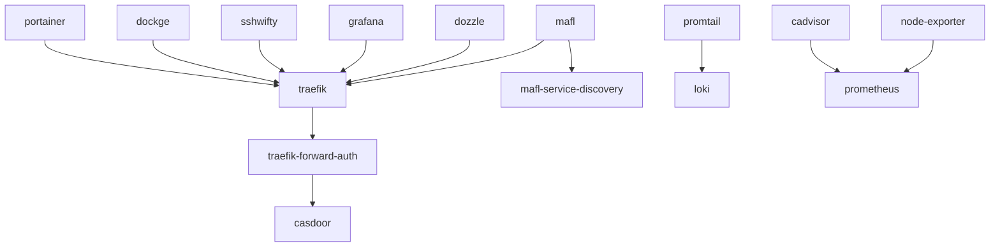

# Overview

The lab has been designed with a focus on modularity, security, and ease of management. By incorporating a variety of components, the architecture ensures that users can efficiently route traffic, authenticate and authorize access, monitor system performance, and manage containerized applications. This comprehensive setup allows users to deploy, observe, and maintain their lab environments with minimal effort, providing a seamless and productive experience. The combination of these components enables users to have a robust, scalable, and secure lab environment that supports a wide range of development and testing activities.

## Architecture 

## Details

The core lab architecture relies on several Docker dependencies to ensure smooth operation and management of the lab environment. Below is a description of the key Docker dependencies used in the core lab architecture:

1. **Traefik**: A modern HTTP reverse proxy and load balancer that makes deploying microservices easy. It is used to route incoming traffic to the appropriate services within the lab.

2. **Traefik Forward Auth**: An authentication middleware for Traefik that forwards authentication requests to an external authentication provider, such as Casdoor.

3. **Casdoor**: An open-source identity and access management (IAM) solution that provides authentication and authorization services for the lab.

4. **MAFL (Microservices Application Framework Layer)**: A framework that facilitates service discovery and communication between microservices within the lab.

5. **Dozzle**: A real-time log viewer for Docker containers, allowing users to monitor container logs directly from the web interface.

6. **Grafana**: An open-source platform for monitoring and observability, used to visualize metrics and logs collected from various services in the lab.

7. **Promtail**: An agent that ships the contents of local logs to a Loki instance, enabling centralized log management.

8. **Loki**: A log aggregation system designed to store and query logs from various sources, integrated with Grafana for visualization.

9. **Node Exporter**: A Prometheus exporter that collects hardware and OS metrics from the host machine, providing insights into system performance.

10. **cAdvisor**: A container advisor that provides resource usage and performance metrics for running containers, integrated with Prometheus for monitoring.

11. **SSHWifty**: A web-based SSH client that allows users to access and manage their lab environment securely through a web browser.

12. **Dockge**: A lightweight Docker container management tool that simplifies the deployment and management of containers within the lab.

13. **Portainer**: A web-based container management platform that provides a user-friendly interface for managing Docker environments, including container creation, deployment, and monitoring.

