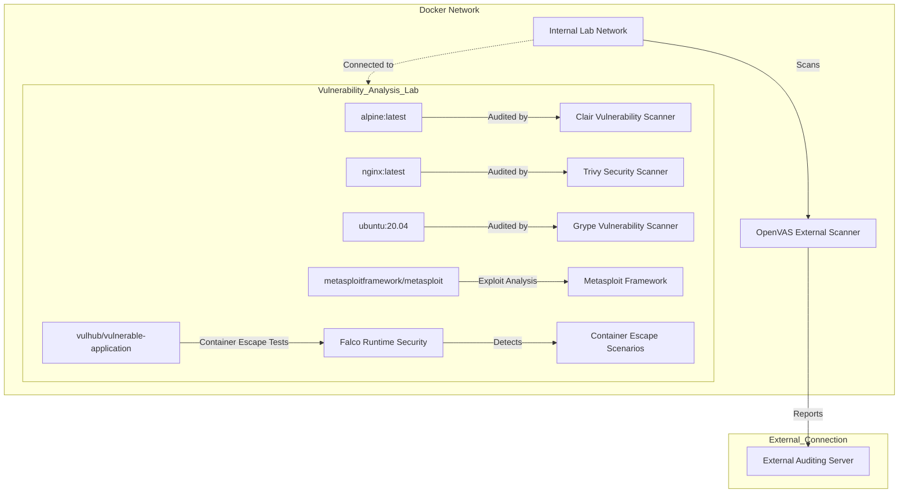

# Cyberlab Ideas

Here are some ideas what could be done within the lab.

## Vulnerability Analysis Lab

### Architecture 

### Example Assigments

#### Assignment 1: Vulnerability Scanning with Clair and Trivy
*Objective:* Analyze the security vulnerabilities in commonly used Docker images using Clair and Trivy.

##### Instructions:

- Pull the alpine:latest and nginx:latest Docker images.
- Set up Clair for scanning the alpine:latest image.
- Set up Trivy for scanning the nginx:latest image.
- For each image, generate a vulnerability report and identify:
- Critical vulnerabilities.
- The CVE numbers associated with these vulnerabilities.
- The recommended remediation steps.
- Discuss the implications of deploying these vulnerable images in a production environment.

##### Deliverables:

- A report detailing the vulnerabilities found in both images, including:
- Screenshots of the vulnerability scan outputs.
- A summary of critical vulnerabilities and remediation options.
- Reflections on the importance of continuous vulnerability scanning in DevOps pipelines.

#### Assignment 2: Container Escape Scenario Exploration with Falco
*Objective:* Investigate container escape scenarios and implement monitoring using Falco.

##### Instructions

- Pull the vulhub/vulnerable-application Docker image.
- Install and configure Falco to monitor for potential container escape attempts.
- Simulate a container escape attack by exploiting known vulnerabilities in the vulhub image.
- Use Falco to detect and log the container escape attempt.
- Analyze Falco's logs to determine how the escape was detected.
- Propose preventive security measures to avoid such vulnerabilities in production environments.

##### Deliverables

- A step-by-step guide on how the container escape was attempted.
- Logs and screenshots from Falco showing the detection of the escape attempt.
- A report summarizing:
  - How Falco was configured to monitor the container.
  - The types of behaviors that Falco flagged during the escape attempt.
  - Recommendations for securing containers to prevent such scenarios.
