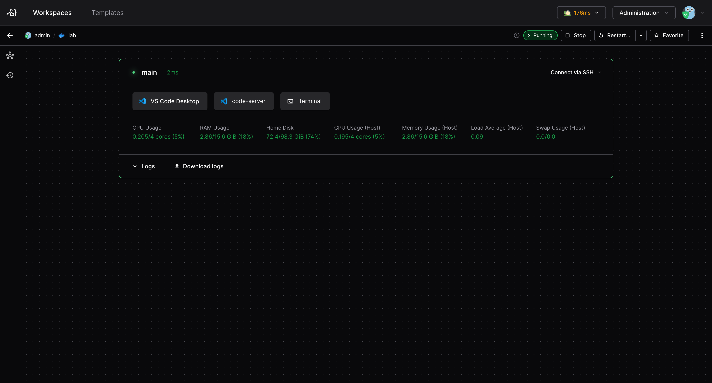
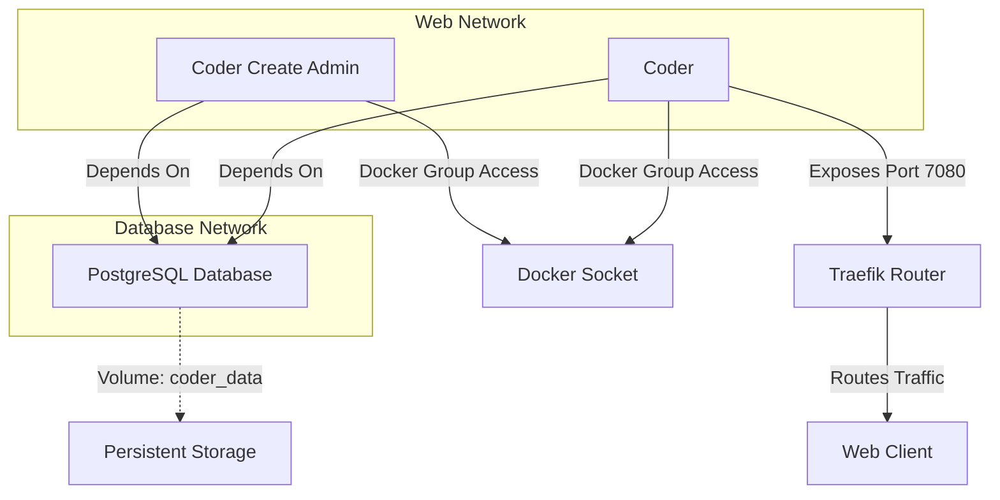

# Overview

Coder is a powerful tool that allows you to deploy pre-defined development environments based on templates using Terraform. This enables you to quickly set up consistent and reproducible development environments, ensuring that all team members have the same setup and can work efficiently.



## Architecture



## Manage

To start the lab, use the following CLI command:

```sh
newpush-lab start lab-tools-coder
```

or visit Dockge and start the `lab-tools-coder` stack. 