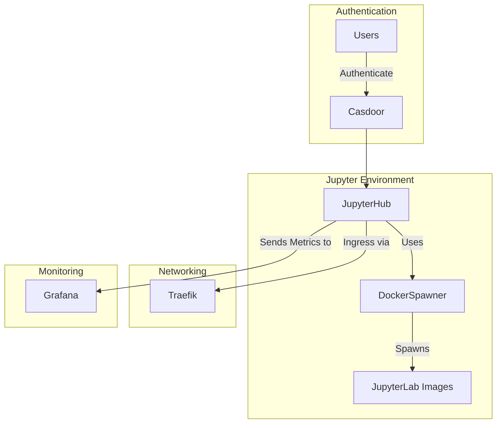
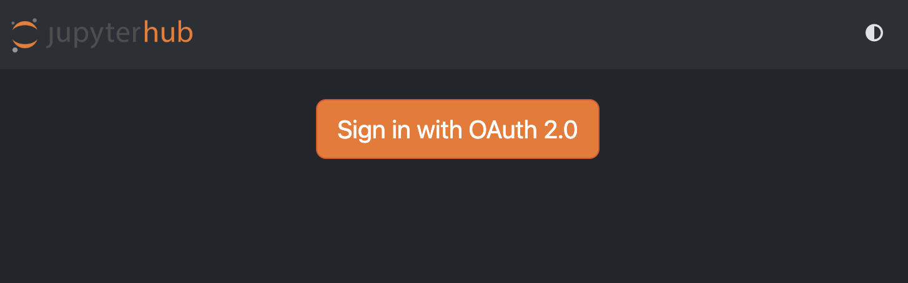
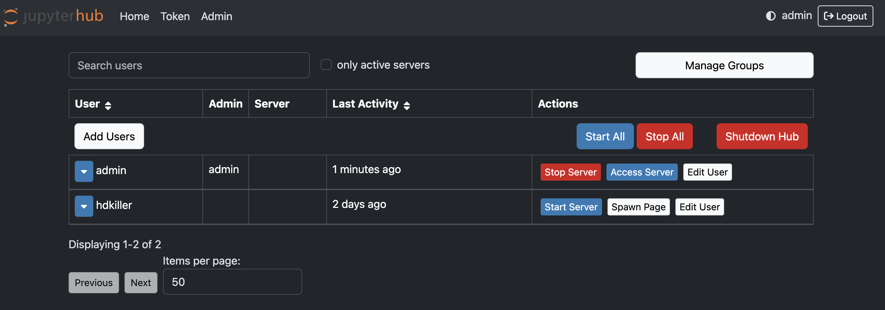
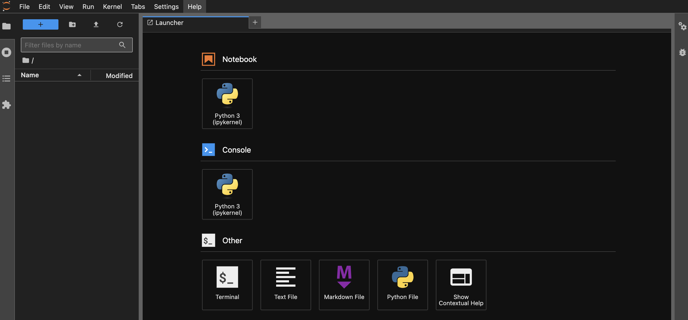

# Overview

JupyterHub is a multi-user platform for hosting Jupyter notebooks. It allows organizations to provide computational environments and resources to multiple users, making it ideal for data science teams, research groups, and educational institutions.

JupyterHub can be customized to use various authentication methods and can spawn individual notebook servers for each user, ensuring a secure and isolated working environment. This setup enables collaborative work on data analysis, machine learning projects, and interactive coding sessions, all while maintaining centralized management and resource allocation.

For more information, visit the [JupyterHub official website](https://jupyter.org/hub).

# Architecture

 Users authenticate via Casdoor, accessing JupyterHub, which employs DockerSpawner to allocate isolated JupyterLab containers. Traefik manages ingress traffic, ensuring efficient routing and security. Metrics from the system are monitored and visualized using Grafana, allowing for insightful analysis of performance and resource use. This setup provides a streamlined, efficient environment for collaborative computational work.



# Manage

To start the lab, use the following CLI command:

```sh
newpush-lab start lab-tools-jupyter-hub
```

or visit Dockge and start the `lab-tools-jupyter-hub` stack. 

Once the JupyterHub service is initiated, its icon will be visible on the dashboard.

For users who haven't authenticated, they can access the system by logging in using their OAuth credentials:



Admin user can mange the environment on the /hub/admin/ location:



Users will be presented by a default notebook:



# Customizing Jupyter Notebook Environments

JupyterHub, by default, launches notebooks using a standard base image. However, you have the flexibility to configure multiple image options or create custom images tailored to your specific needs. This allows you to provide users with specialized environments containing pre-installed libraries, tools, or datasets.

To explore advanced configuration options for Docker-based deployments, including how to set up multiple images or create custom ones, refer to the comprehensive [DockerSpawner documentation](https://jupyterhub-dockerspawner.readthedocs.io/en/latest/spawner-types.html#swarmspawner).
